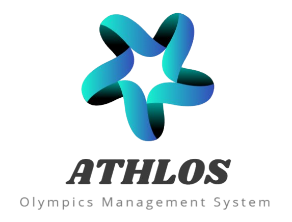

 
<h3 align="center">

</h3>
 

 <a href="#Ahtlos"> Introducion </a> •
 <a href="#Group-Members"> Group Members </a> • 
 <a href="#Project-Description"> Project Description </a> • 
 <a href="#Documentation"> Documentation </a>

# Ahtlos

Ahtlos is a system developed to manage the different aspects of the Olympic Games, such as competitions, athlete registrations, venue allocation, result control, and medal reports. 

# Group Members
* [Gabriel Ramos Ferreira](https://github.com/gramos22)
* [João Pedro Silva Braga](https://github.com/joaopedro-braga)

# Project Description

This project aims to develop a comprehensive management system for the Olympic Games. The system will streamline various aspects of the event, including competition organization, athlete registration, venue allocation, result tracking, and medal tally reporting. 

### Functionalities
* **Competition Management:** 
    * Allows for the registration of different sports competitions.
    * Includes details such as event name, date, time, venue, and a list of participating athletes.
* **Athlete Registration:** 
    * Enables athletes from various countries to register for specific competitions.
    * Manages athlete information, ensuring each athlete represents only one country per sport while allowing participation in multiple disciplines.
* **Venue Allocation:**
    * Provides a system to allocate venues for each competition.
    * Prevents scheduling conflicts by ensuring a venue hosts only one competition at a time.
* **Result Control:** 
    * Enables the recording of competition results.
    * Determines and records the winner, second, and third place for each event.
* **Medal Reports:** 
    * Generates medal tally reports to track the performance of each participating country.
    * Displays the number of gold, silver, and bronze medals won by each country.
  
### Technologies Utilized

# Documentation
### User Stories

## Use Case Diagram

## Class and Package Diagram

## Component Diagram

## Deployment Diagram

