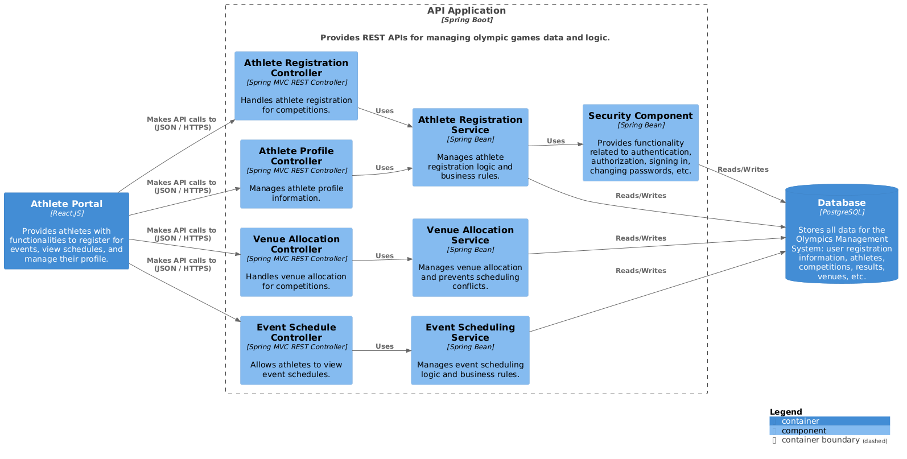

<br>
<h3 align="center">

</h3>
<br>
<p align="center">
 <a href="#Ahtlos"> Introducion </a> •
 <a href="#Group-Members"> Group Members </a> • 
 <a href="#Project-Description"> Project Description </a> • 
 <a href="#Documentation"> Documentation </a>
</p>

# Athlos

Athlos is a system developed to manage the different aspects of the Olympic Games, such as competitions, athlete registrations, venue allocation, result control, and medal reports. 

# Group Members
* [Gabriel Ramos Ferreira](https://github.com/gramos22)
* [João Pedro Silva Braga](https://github.com/joaopedro-braga)

# Project Description

This project aims to develop a comprehensive management system for the Olympic Games. The system will streamline various aspects of the event, including competition organization, athlete registration, venue allocation, result tracking, and medal tally reporting. 

### Functionalities
* **Competition Management:** 
    * Allows for the registration of different sports competitions.
    * Includes details such as event name, date, time, venue, and a list of participating athletes.
* **Athlete Registration:** 
    * Enables athletes from various countries to register for specific competitions.
    * Manages athlete information, ensuring each athlete represents only one country per sport while allowing participation in multiple disciplines.
* **Venue Allocation:**
    * Provides a system to allocate venues for each competition.
    * Prevents scheduling conflicts by ensuring a venue hosts only one competition at a time.
* **Result Control:** 
    * Enables the recording of competition results.
    * Determines and records the winner, second, and third place for each event.
* **Medal Reports:** 
    * Generates medal tally reports to track the performance of each participating country.
    * Displays the number of gold, silver, and bronze medals won by each country.
  
### Technologies Utilized
* **Use Case Diagram:** Figma
* **Class and Package Diagram:** Figma
* **Component Diagram:** PlantUML
* **Deployment Diagram:** PlantUML


# Documentation
### User Stories
#### US01 - Create a Competition
```
As an event organizer,
I want to create a new competition,
so that athletes can register and participate.
```

#### US02 - Register an Athlete
```
As an athlete,
I want to register for a specific competition and represent my country,
so that I can compete.
```

#### US03 - Prevent Duplicate Athlete Registration
```
As a system,
I should prevent an athlete from registering for the same modality representing different countries,
to ensure fair competition.
```

#### US04 - Allocate Competition Venue
```
As an event organizer,
I want to allocate a venue to a competition considering its date and time,
so that there are no scheduling conflicts.
```

#### US05 - Prevent Venue Double Booking
```
As a system,
I should prevent booking the same venue for two competitions at the same time,
to avoid conflicts.
```

#### US06 - Record Competition Results
```
As a competition official,
I want to record the results of a competition, including the top three athletes,
so that the system can generate reports and rankings.
```

#### US07 - Generate Medal Tally Report
```
As an event organizer,
I want to generate a report that shows the medal tally for each country,
so that I can track the overall performance of participating nations.
```

#### US08 - Manage Competition Details
```
As an event organizer,
I want to be able to edit competition details (date, time, venue, registered athletes),
so that I can keep the information up-to-date and manage the competition effectively.
```


## Use Case Diagram


[Access Figma](https://www.figma.com/board/ZspA2mT79CjrHIdlJ2SnQ2/Use-Case-Diagram---Asthlos?t=VP0BPVo9Vw2czaf4-0)

## Class Diagram


[Access Figma](https://www.figma.com/board/whIVO401DCNuozs4Zx10HS/Class-and-Package-Diagram---Athlos?node-id=0-1&node-type=canvas&t=VP0BPVo9Vw2czaf4-0)

## Package Diagram


[Access Figma](https://www.figma.com/board/whIVO401DCNuozs4Zx10HS/Class-and-Package-Diagram---Athlos?node-id=0-1&node-type=canvas&t=VP0BPVo9Vw2czaf4-0)

## Component Diagram



## Deployment Diagram


